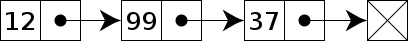
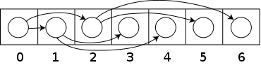

# Roy's Programming Interview Cheat-Sheet
This guide was initially created by [Roy Mathew](https://github.com/Varghese77/My-Technical-Interview-Cheat-Sheet)


## Table of Contents
* [Linked Lists](#linked-lists)
  - [Types of Linked Lists](#types-of-linked-lists)
  - [Add and Remove Operations](#linked-list-add-remove)
* [Graphs and Trees](#graphs-and-trees)
  - [Graph Definitions and Implementations](#graphs-definition-implementations)
  - [Graph Search Algorithms](#graphs-search-algorithms)
  - [Tree Definitions](#tree-definition-terminology)
  - [Tree Traversal](#tree-traversal)
  - [Binary Search Trees](#binary-search-trees)
  - [Heap Definition](#heap-definition)
* [Arrays and Strings](#arrays-and-strings)
  - [Array Notes](#array-notes)
  - [String Notes](#string-notes)
* [Recursion](#recursion)

<a id="linked-lists"></a>

## Linked Lists

<a id="types-of-linked-lists"></a>

#### Types of Linked Lists
A linked lists is a list of elements represented as a serial connection of nodes. There are three types of linked lists.

<br/>
<br/>


<div style="text-align:center">
  
</div>

<br/>
<br/>

1. A ```Singly Linked List``` is implemented with nodes having a single reference to the next element in the list (or ```null``` if there is none). A singly node might be implemented as...

    ``` java
    public class Node<E> {
      E val;
      Node next;
    }
    ```

    and could look like:

        head -> node1 -> node2 -> ... -> nodeN -> null

<br/>
<br/>

<div style="text-align:center">
  
</div>

<br/>
<br/>

2. A ```Doubly Linked List``` is implemented with nodes having references to **both** the previous and next nodes. A doubly node might be implemented as...

    ``` java
    public class Node<E> {
      E val;
      Node next;
      Node prev;
    }
    ```

    and could look like:

        head -> node1 <-> node2 <-> ... <-> nodeN (_tail_) -> null
        Note: 'nodeA <-> node B'means that nodeA.next = nodeB AND nodeB.prev = nodeA

<br/>
<br/>

<div style="text-align:center">
  
</div>

<br/>
<br/>

3. A ```Circular Linked List``` can either be singly or doubly with the main difference being that the last element in the list's next node loops back to the head as opposed to ```null```.

    A circular singly linked list might look like:

        head -> node1 -> node2 -> ... -> nodeN -> node1 -> node2 -> ... (no end)

It is important to note that the head an tail pointers must exist at **ALL** times to prevent a memory leak and point to the correct elements after any modification. Head and tail prev/next values are different from middle nodes so make sure they are updated correctly.

<a id="linked-list-add-remove"></a>

#### Add / Remove Operations

Since all linked lists have a head pointer, inserting an element, if order doesnt matter, is simply a matter of inserting at the head pointer for an ```O(1)``` insertion time.

**if head == null, then...**
> head = new Node(val);

**if head != null, then...**
> newHead == new Node(val);
> newHead.nxt = head;
> head = newHead


Likewise, removing from the head means simply making ```head = head.next``` to pop off the first element and runs in ```O(1)``` insertion time.

Inserting/removing an element from the middle of the list requires traversing the list until the correct place has been found. Note that this insertion/deletin requires a pointer to the node **before** where we want to insert or delete.

**Insert x at Index i**

``` java
public void insert(E x, int i) {
  Node<E> curr = head;
  
  // Note the i - 1 bound
  for (int k = 0; k < i - 1; i++) {
    curr = curr++;
  }
  Node<E> newNode = new Node<E>(x);
  newNode.next = curr.next;
  curr.next = newNode;
}
```

**Remove x (Assume x Isn't in the Head)**

``` java
public E insert(E x, int i) {
  Node<E> curr = head;
  
  // note checking curr.next != null first
  while (curr.next != null && !curr.next.val.equals(x)) {
    curr = curr.next;
  }
  if (curr.next != null) {
    E res = curr.next.val;
    curr.next = curr.next.next;
    return res;
  }
  return null;
}
```

<a id="graphs-and-trees"></a>

## Graphs and Trees

<a id="graphs-definition-implementations"></a>

#### Graphs Definitions and Implementations

A graph is a collection of ```Verticies``` or nodes which themselves have references to any number of other verticies.

These references are refered to as ```Edges``` and have many classifications...
* A ```Directed``` edge from verticies A to B mean that A references B but B doesn't reference A via the same edge.
* An ```Undirected``` edge from verticies A to B mean that A references B and B references A via the same edge.
* A ```Weighed``` edge means that there is a value associated with the edge.
* An ```Unweighed``` edge means that there is no value associated with the edge.

All the verticies that a vertex v references are called its ```Neighbors``` or ```Children``` whereas v is refered to as the ```Parent ```.

Graphs themselves can also be ```MultiGraphs``` meaning multiple edges can exist between any same two verticies.

There are three main ways to implement a graph...

1. ```Edge List```: Simple list of vertex pairs representing every edge in the graph
    * Note: This implementation  is less commonly used because of its drawbacks, mainly ```O(n)``` edge and vertex lookup time and inability to store isolated subgraphs.
2. ```Adjacency List```: A list of verticies with each vertrex storing a list of verticies it references.
3. ```Adjacency Matrix```: For n verticies, create an n x n 2D array where each index represents vertex with an id = 0..i...n and arr[i1][i2] = edge value.
    * Adjacency Matrix should be used where the number of verticies rarely change and the number of edges is at least half of the number of verticies squared.

<a id="graphs-search-algorithms"></a>

#### Graph Search Algorithms

Graph search algorithms are used when you want to find if a path between two verticies exists.

The first search algorithm is ```Breadth First Search``` which starts at a single vertex and searches all vertexes 1 edge away, then 2 edges away, ..., then n edges away until either the path is found or there are no more edges to search. The pseudocode for BFS is...

    HashTable H  // For visited verticies
    Queue Q
    
    Q.enqueue(<Starting Vertex>)
    while Q IS NOT empty {
        Vertex V = Q.dequeue()
      
        if H DOES NOT contain V {
            add V to H
        
            for Edge E in V.edges() {
                // E = (V1, V2)
                if H DOES NOT contain V2 {
                    Q.enqueue(V2)
                }
            }
         }
      }

The second search algorithm is ```Depth First Search``` which starts at a single vertex and searches as far away from the starting node as the algorithm can get before backtracking. The pseudocode for DFS is...

    HashSet H  // For visited verticies
    Stack S
    
    S.push(<Starting Verted>)
    while S IS NOT empty {
        Vertex V = s.pop()

        if H DOES NOT contain V {
            add V to H
            
            for Edge E in V.edges() {
                  // E = (V1, V2)
                  if H DOES NOT contain V2 {
                       S.push(V2)
                  }
            }
         }
    }

Notice how the only difference between the BFS and DFS algorithm is whether we use a queue or a stack to store nodes to traverse. Also note how in these particular algorithms, the actual path isn't being returned but rather only if the path exists. If you want to keep track of the actual path than each time you first view a vertex you need to keep track with a hashtable or an array which vertex was it was linked from.

The worst case time complexity of both BFS and DFS = ```O(|V| + |E|)``` where |V| represents the number of nodes and |E| represents the number of edges. The worst case space complexity for both is ```O(|V|)```.

The last search algorithm is ```Dijkstras Algorithm``` assumes that the graph is **weighed, has no negative edge costs, and is acyclic (more on this later)**. This search algorithm finds the total cost of the least weight cost path between two verticies. The pseudocode for Dijkstra's Algorithm is...

    // Assume all Vertex.dist = Infinity
    // otherwise either iterate and do so 
    // or create a Comparator in Java
    
    Priority Queue PQ // Min-heap
    startVertex.dist = 0;
    PQ.insertAll(graph.getVertices())

    while (PQ is not empty) {
      vertex = PQ.remove()
      edges = vertex.getEdges()

      for all edges {
        destination = edge.getDestination()
        newDistance = edge.getLength() + vertex.getDistance()
        if (newDistance < destination.getDistance()) {
          destination.setShortestDistance(newDistance)
          PQ.update(destination)
        }
      }
    }

<a id="tree-definition-terminology"></a>

#### Tree Definition and Terminology

A ```Tree``` is a special form of a graph that has two properties which always hold.

1. A tree is a graph that is directed.
2. A tree is a graph that is ```acyclic``` meaning that once you leave a vertex it is impossible to 'cycle' back to it.

The following terminology is important to know relating to trees...

* In trees, verticies are refered to as ```Nodes```.
* In trees, edges are refered to as ```Branches```.
* In trees, the nodes at the bottom with no children are refered to as ``Leaves```.
* A ```Descendent``` of a node is all the nodes that can be reached after leaving the current node (i.e think family tree).
* An ```Ancestor``` of a node is all the nodes previous that can connect to this node (i.e think family tree).
* A ```Sibling``` of a node is another node which shares the same parent.
* A ```Cousin``` of a node is another node on the same level.

<a id="tree-traversal"></a>

#### Tree Traversal

Since a tree is just a graph in disguise, we can use BFS to traverse a tree. Here are the 3 main DFS-based tree traversal algorithms and their Java implementation. (Note we assume that the tree has only two child nodes)

1. ```Pre-Order Traversal```

    ``` java
    public void preOrderTraversal(Node<E> root) {
      if (root == null) {
        doSomething(null);
        return;
      }
      doSomething(root.val);  // Operate on Root
      preOrderTraversal(root.left); // traverse left
      preOrderTraversal(root.right);  // traverse right
    }

    ```
2. ```In-Order Traversal```

    ``` java
    public void inOrderTraversal(Node<E> root) {
      if (root == null) {
        doSomething(null)
        return;
      }
      inOrderTraversal(root.left); // traverse left
      doSomething(root.val);  // Operate on Root
      inOrderTraversal(root.right);  // traverse right
    }

    ```
3. ```Post-Order Traversal```

    ``` java
    public void postOrderTraversal(Node<E> root) {
      if (root == null) {
        doSomething(null)
        return;
      }
      postOrderTraversal(root.left); // traverse left
      postOrderTraversal(root.right);  // traverse right
      doSomething(root.val);  // Operate on Root
    }

    ```

Notice that the call stack functions as the actual stack for DFS in these algorithms. Note that the only difference between the tree algorithms is the order of the three body statements. The time complexity of each of these traversals is ```O(n)```. 

Using BFS, we can perform another type of traversal called a ```Level-Order Traversal```. The pseudo-code for it is below

``` java
public static void levelOrderTraversal(Node<E> root) {
  Queue<E> q = new LinkedList<>();
  q.add(root);
  while (!q.isEmpty()) {
    Node<E> curr = q.remove();
    doSomething(curr);  // Operate on node
    if (q.left != null) {
      q.add(curr.left);
    }
    if (q.left != null) {
      q.add(curr.right);
    }
  }
}
```

<a id="binary-search-tree"></a>

#### Binary Search Trees

<div style="text-align:center">
  
</div>

The most common form of a tree that you will encounter in an interview is the ```Binary Search Tree``` which are used to store ordered data. A BST has the following properties...

1. Each node can have at most two children refered to as the 'left' and 'right' child.
2. Given any node **_N_** in the BST, any node in **_N_**'s left subtree has a value less than or equal to **_N_**'s value.
3. Given any node **_N_** in the BST, any node in **_N_**'s right subtree has a value greater than **_N_**'s value.
4. Any given subtree in a BST must be a BST as well.

To check if any given tree is a BST, you must make sure that all of the above properties hold. The following Java code does this.

``` Java
// Assume Node.val is an int
public static boolean isBST(Node root) {
  return isBST(root, Integer.MIN_VALUE, Integer.MAX_VALUE)
}

private static boolean isBST(Node root, int min, int max) {
  if (root == null) {  // A null value is always a BST
    return true;
  }

  // check to see if this node is in the correct bounds
  if (root.val > max || root.val < min) {
    return false;
  }

  return isBST(root.left, int min, root.val) &&
    isBST(root.right, root.val + 1, max);
}
```

Note that we use recursively pass in a range of possible values for each node and update that range for each function call. We do this because the BST properties apply to **entire subtrees**, not just particular nodes and this we need a range to represent all possible number of remaining valid values.

In addition, the ```Height``` of a tree is defined as the amount of edges needed to reach thur furthest away node. For example, an empty tree has a height of -1 (undefined), a single node has a height of 0, if that node had a child it would have a height of 1, if it had a grand-child it would have a height of 2 ect.

The BST is considered ```Balanced```, if for ever node in the BST, the difference between the heights of the left and right subtree differ by **at most** one. The following Java code checks of a BST is balanced. A balanced tree has a height of **about** ```log(n)```

``` java
public boolean isBalanced(TreeNode root) {
        return isBalancedUtil(root) != -2;
    }
    
private int isBalancedUtil(TreeNode root) {
    if (root == null) {
        return -1; // definition of null in terms of the BST
    }
    
    // Finds the height of the children nodes
    int leftHeight = isBalancedUtil(root.left);
    int rightHeight = isBalancedUtil(root.right);

      // check height differences   
    int diff = (int) Math.abs(leftHeight - rightHeight);
    if (diff > 1) {
        return -2;  // return value signalling that tree isn't balanced
    } else if (leftHeight == -2 || rightHeight == -2) {
        return -2;  // return value signalling that tree isn't balanced
    } else {
        return (int) Math.max(leftHeight, rightHeight) + 1;
    }
}
```

This solution works but doesn't exactly have the best style. There are probably better solutions out there.

<a id="heap-definition"></a>

#### Heap Definition

<div style="text-align:center">
  
</div>

A ```Heap``` is a special kind of tree (note, not a BST) that satisfies the heap property: _if **P** is a parent node of **C**, then the value of **P** is either greater than or equal to (in a max heap) or less than or equal to (in a min heap) the key of **C**_. Note that there is no relationship between sibling or cousin nodes.

A ```Max-Heap``` is a heap in which the root is the greatest value in the heap and all other children have less value than the root and a ```Min-Heap``` is a heap in which the root has the least value and all others are less than or equal to the root's value.

Before talking about heap operations, it is important to note that although heaps are often talked about as trees, they are often implemented using arrays instead. This is an example of where a Data Structure's ```Abstract Data Type``` differs from its ```Implementation```. We can implement a heap as an array because we don't care about exact ordering of elements, only that there is a way to keep track of parent to child relationships.

<div style="text-align:center">
  
</div>

We will talk more about how to insert/remove elements to insure correct order but if we put the root's value at index 0, then for any given node who's value is located at index i...

1. its children's values are located at index 2i + 1 and 2i + 2
2. its parent's value is located at index floor((i-1) / 2)

As a result, we can compactly store a heap in an array with ```O(1)``` access time to each element **Internally** which will greatly help with the adding/removing operations described below.

#### Heap Operations

The two most important heap operations are ```Push``` which inserts an element into a heap,  ```Pop``` which removes the root element, 
and ```Peek``` which returns the root element without removing it.

To implement peek, simply return a pointer to the root element.

To implement push, there are four main steps...
1. Add element to the bottom of the heap (note that this will be the next unfilled index in an array)
2. Compare the inserted item with its parents; if the comparison maintains the heap property or if the node is the root then stop.
3. Otherwise swap the parent and inserted heap element. This is known as ```Percolating Up```. Then return back to step 2.

To implement pop, there are three main steps...
1. Replace the root with the last element in the heap (keep a reference though so that it can be returned later).
2. Compare the previously last item with its new children; if the comparison maintains the heap property or if the node has no children then stop.
3. Otherwise swap the root with the child that breaks the heap property. This is known as ```Percolating Down``` and return to step 2.
4. Return the original root element or value.

Note that each time you pop an element, the next root becomes either the next largest or next smallest element in the heap depending on the heap type. As a result popping out all the elements in a heap gives you their sorted order.

Because a heap is guarenteed to be balanced at all times, percolating up or down can make at most ```O(log(n))``` comparisons and as a result this is the time complexity of push and pop.

<a id="arrays-and-strings"></a>

## Arrays and Strings

<a id="arrays-notes"></a>

#### Array Notes

An array is a sequence of variables arranged **contiguously** in a block of memory. I will only write some brief nodes because I assume that you have heard of arrays before.

* ```Static Arrays``` are arrays which are constant in size
* ```Dynamic Arrays``` are resizable (think ArrayLists) but use static arrays internally.
* Inserting or Removing an item from a sorted array requires ```O(n)``` time as all the other elements in the array have to be shifted over.
* While in C/C++ Arrays literally refer to a block of memory, in higher-level languages arrays are often implemented as objects internally (like in Java) with special fields and methods.

<a id="string-notes"></a>

#### String Notes

Strings are a sequence of characters (although what constitutes a character widely differs depending on the context).

```MultiByte Encodings``` for characters are becoming more commonplace.
* One such encoding is ```ASCII Encoding``` in which all chars are represented with a single 8-bit char.
* Another such encoding is ```UTC-16``` (default in Java and C#) in which most Unicode codes are represented with single character is represented with a single 16-bit char and the rest are represented with two 16-bit chars.
* Another encoding is ```UTC-8``` is used for text encodings across networks and uses 1-4 8-bit chars to encode characters. Note that ASCII encoding is a subset of UTC-8.

<a id="recursion"></a>

## Recursion


